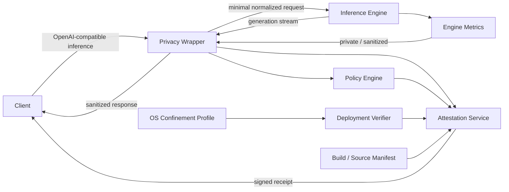
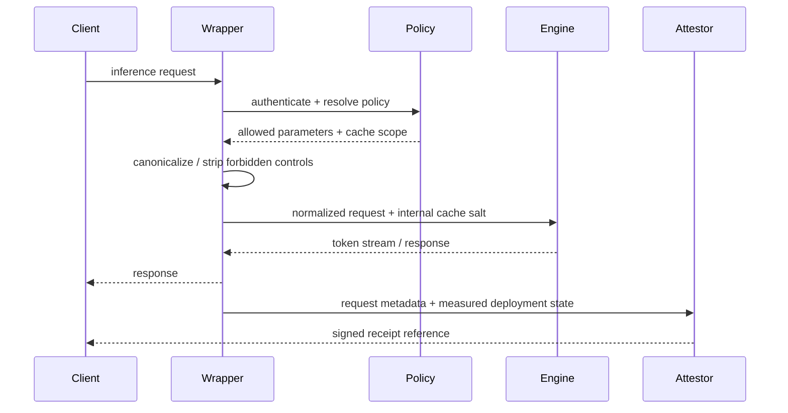
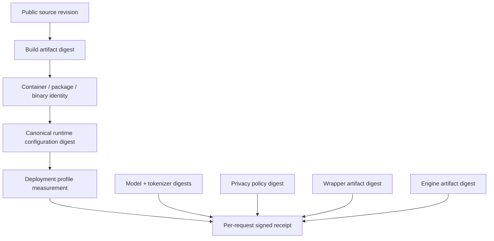

# Verifiable Privacy for Shared Inference

Status: architecture proposal

Date: 2026-08-12

This document defines an architecture for offering shared LLM inference with privacy claims that are inspectable, testable, and cryptographically attributable to a specific software and deployment state.

The goal is **verifiable privacy**, not a claim of mathematically provable privacy.

> Maximize what can be verified, minimize what must be trusted, and state the remaining trust assumptions explicitly.

## Problem statement

A hosted inference user ultimately cares about a small set of questions:

1. Did my prompt and completion go only where the service says they went?
2. Was my inference content logged, persisted, or exposed to another tenant?
3. Could another tenant learn anything about my prompt through shared cache behavior?
4. What software, model, configuration, and deployment policy handled my request?
5. Can I independently inspect the implementation and verify evidence about the runtime state?

A privacy policy can answer these questions in prose. This design aims to attach evidence to the answers.

## Core design principles

1. **The engine computes; the wrapper enforces and proves.**
2. **Keep the inference engine replaceable.** vLLM is the first concrete Linux/CUDA engine target, not a permanent trust dependency.
3. **Do not expose low-level engine controls to inference clients.** Public APIs accept inference inputs, not deployment or privacy-policy mutations.
4. **Every privacy claim maps to enforcement, evidence, and an adversarial test.**
5. **Fail closed when required controls cannot be established or verified.**
6. **Do not put raw prompts or completions into attestations.**
7. **Open source the wrapper and publish reproducible identities for source, build, configuration, and policy where feasible.**
8. **Treat trust assumptions as part of the product contract.** Hypervisor, firmware, cloud administrator, and physical-host guarantees must never be silently implied by application-level evidence.
9. **Debuggability must not require routine payload visibility.** Payload-bearing debug modes are exceptional, explicit, time-bounded, and auditable.
10. **The wrapper is a reference monitor, not a debugger attached to engine memory.** It controls the allowed ingress and egress paths; it does not inspect or mutate another process's heap or stack.

## High-level architecture

The wrapper terminates the public API. The engine is reachable only through a private local or isolated network path controlled by the deployment profile.

The wrapper is responsible for:

- client authentication and tenant identity;
- normalization and allowlisting of inference parameters;
- stripping or overriding engine-specific privacy controls supplied by clients;
- deriving tenant/request cache-isolation material;
- routing the minimum request to the engine;
- returning model output without creating a second hidden retention path;
- enforcing the active privacy policy;
- refusing traffic when the deployment state does not match policy;
- producing evidence for the request and deployment.

The inference engine remains responsible for model execution, scheduling, batching, and KV-cache management. It is not allowed to define the service's privacy contract.

## Mandatory request path

No external client should be able to bypass the wrapper and reach the engine directly.

## API separation

The public surface is intentionally split:

### Inference API

Start with the narrowest useful compatibility surface, preferably OpenAI-compatible endpoints. Anthropic compatibility can be added independently if product demand justifies it.

The inference API must not expose deployment controls such as request logging, access logging, cache-sharing policy, external KV connectors, profiling, tracing, or debug configuration.

### Verifiability API

A separate API exposes:

- the current privacy policy identity;
- signed request receipts;
- wrapper/build/source identities;
- model and engine identities;
- deployment-profile identity;
- measured control state;
- evidence-chain verification material.

The initial contract is defined in [ATTESTATION_API.md](ATTESTATION_API.md).

## Evidence chain

The evidence chain should allow a reviewer to answer:

- which public source revision corresponds to the wrapper;
- what artifact was built from that source;
- what artifact and model were actually selected for the deployment;
- what canonical configuration and privacy policy were active;
- whether required deployment controls were measured as present;
- which evidence applied to a particular request.

This chain does **not** by itself prove that a malicious hypervisor, host root user, GPU firmware, or physical attacker could not observe memory. Those remain explicit trust assumptions until a hardware-backed confidential-computing layer is introduced and independently validated.

## vLLM as the first engine target

Current vLLM behavior gives the wrapper useful control points without requiring a fork:

- request-information logging is controlled by `--enable-log-requests` and is disabled by default; DEBUG-level request logging can include prompt text or token IDs;
- generation logging is separately gated by `--enable-log-outputs` and requires request logging;
- uvicorn access logging has a separate disable control;
- Automatic Prefix Caching supports a per-request `cache_salt` specifically to isolate cache reuse and mitigate timing-based cache-content inference;
- the cache configuration supports SHA-256 hashing, while vLLM warns that non-cryptographic hashing increases multi-tenant leakage risk;
- production metrics are exposed by the server and therefore belong on a private monitoring path rather than the public inference path.

The wrapper must own these policy decisions. A client-supplied `cache_salt` or other engine extension must never be trusted as the isolation boundary.

Current upstream references:

- https://docs.vllm.ai/en/latest/cli/serve/
- https://docs.vllm.ai/en/stable/configuration/engine_args/
- https://docs.vllm.ai/en/stable/examples/others/logging_configuration.html
- https://docs.vllm.ai/en/stable/api/vllm/config/cache/
- https://docs.vllm.ai/en/latest/usage/metrics/
- https://docs.vllm.ai/en/stable/design/prefix_caching/

## Trust boundaries

### We intend to verify

- wrapper source/build identity;
- engine artifact identity;
- model/tokenizer identity;
- canonical runtime configuration;
- privacy-policy identity;
- deployment-profile measurements visible to the guest OS;
- whether required engine flags and wrapper controls are active;
- network/process confinement observable from the guest;
- signed evidence associated with a request.

### We intentionally do not claim to verify yet

- cloud-provider administrators;
- the hypervisor implementation;
- host kernel state outside the guest boundary;
- GPU firmware/microcode behavior;
- physical memory probes;
- provider retention outside interfaces visible to the guest;
- absence of a sufficiently privileged external observer.

These are provider and infrastructure trust assumptions today. Confidential-computing and hardware-attestation work may reduce that trusted base later.

## Debug and break-glass principle

Routine diagnostics should use non-content signals: GPU utilization, scheduler state, queue depth, latency distributions, memory pressure, process health, and stack traces that have been reviewed for content exposure.

Any mode that can reveal prompts, completions, token IDs, raw request bodies, model outputs, memory dumps, or equivalent content is a privacy-policy transition. It must be:

- disabled by default;
- impossible for an inference client to enable;
- explicitly authorized by an operator with the appropriate role;
- time-bounded;
- visible in deployment evidence;
- auditable after the fact;
- incapable of silently preserving old privacy attestations while active.

A future production policy may prohibit payload-bearing debugging entirely on customer-serving nodes.

## Documentation map

- [THREAT_MODEL.md](THREAT_MODEL.md) — assets, adversaries, attack surfaces, assumptions, and security goals.
- [PRIVACY_CONTROLS.md](PRIVACY_CONTROLS.md) — the control catalogue mapping claims to enforcement, evidence, and tests.
- [ATTESTATION_API.md](ATTESTATION_API.md) — the initial verifiability API and receipt schema.
- [DEPLOYMENT_PROFILE.md](DEPLOYMENT_PROFILE.md) — process, OS, network, logging, and memory-handling baseline.
- [TESTING_STRATEGY.md](TESTING_STRATEGY.md) — cheap-first functional verification, GPU gates, and adversarial testing.
- [FUTURE_RESEARCH.md](FUTURE_RESEARCH.md) — supply-chain provenance, confidential computing, stronger attestation, and alternative engines.
- [OPEN_QUESTIONS.md](OPEN_QUESTIONS.md) — deliberately unresolved design decisions.

## Definition of success for the architecture phase

This phase succeeds when every material privacy statement can be expressed in the following form:

> **Claim:** what the service says is true.  
> **Enforcement:** what mechanism makes it true.  
> **Evidence:** what an independent reviewer can inspect or verify.  
> **Adversarial test:** how we actively try to make the claim false.

No production privacy promise should graduate beyond architecture until it has all four.