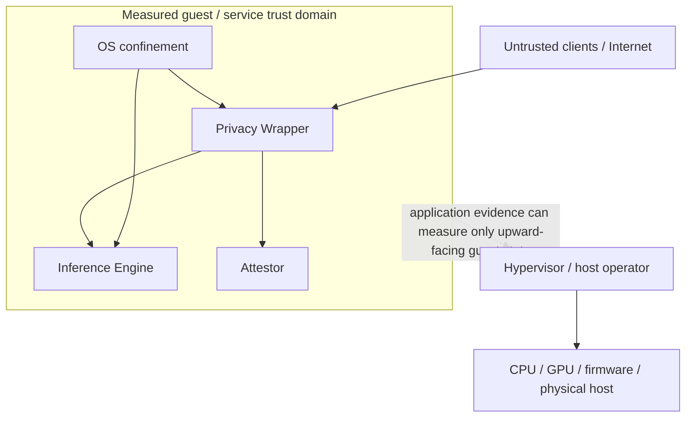

# Verifiable Privacy Threat Model

Status: initial threat model

This threat model describes what the wrapper is designed to protect, which adversaries it considers, and where the first version deliberately stops making guarantees.

## Assets

The primary protected assets are:

- prompt text, message history, images, tool payloads, and other inference inputs;
- model completions, tool calls, embeddings, reranking inputs/outputs, and other inference results;
- tokenized forms of user content;
- in-memory KV/prefix-cache state derived from user content;
- tenant identity and request-to-tenant linkage;
- model-selection and usage metadata where it can reveal sensitive behavior;
- attestation signing keys and deployment-verification keys;
- policy configuration, source/build manifests, and evidence records;
- administrator credentials and break-glass authorization state.

## Security goals

### G1 — No cross-tenant inference-content disclosure

One tenant must not receive another tenant's prompts, completions, token IDs, KV state, or content-bearing diagnostics through an application interface.

### G2 — No cross-tenant cache reuse unless explicitly allowed by service policy

Cache reuse must be scoped by a wrapper-controlled isolation value. The client may not select a broader sharing scope.

### G3 — No routine inference payload logging

Normal production logging must not contain prompt text, raw request bodies, token IDs, generated text, or equivalent content.

### G4 — No direct public path to the engine

External clients must communicate through the wrapper. The engine API, metrics endpoint, profiling interfaces, and administrative endpoints must not be directly internet-reachable.

### G5 — Privacy configuration is fail-closed

The wrapper refuses customer traffic when required privacy controls cannot be measured or do not match the active policy.

### G6 — Evidence is attributable and tamper-evident

A request receipt must be cryptographically bound to a policy identity and a measured deployment identity.

### G7 — Privacy exceptions are visible

A break-glass/debug state that weakens privacy must invalidate ordinary privacy claims and appear in deployment evidence.

### G8 — Trust assumptions are explicit

Application evidence must never be presented as proof about layers it cannot measure, such as a malicious cloud hypervisor.

## Adversaries and failure modes

### A1 — Malicious or curious co-tenant

Capabilities:

- sends arbitrary valid inference requests;
- measures response timing and throughput;
- attempts to submit engine-specific extensions;
- observes its own usage/metrics exposed by the public API;
- tries to infer whether another tenant's prefix is cached.

Primary mitigations:

- wrapper-owned tenant cache salt;
- no direct engine endpoint;
- no cross-tenant identifiers in public metrics;
- request normalization and allowlisting;
- timing-side-channel tests.

### A2 — Untrusted remote client

Capabilities:

- malformed or oversized requests;
- header abuse;
- attempts to reach internal engine/admin routes;
- attempts to enable logging, tracing, profiling, cache sharing, or debug modes.

Primary mitigations:

- authenticated wrapper boundary;
- strict request schema and size limits;
- engine network isolation;
- parameter allowlist;
- rate/abuse controls outside the privacy core.

### A3 — Operator mistake or configuration drift

Examples:

- starting vLLM with request logging enabled;
- exposing the engine port publicly;
- enabling a KV connector or profiler not present in the approved policy;
- changing logging level to DEBUG while request logging is enabled;
- re-enabling swap or crash dumps;
- deploying an unapproved engine binary.

Primary mitigations:

- canonical deployment profile;
- startup verification;
- continuous drift checks where practical;
- fail-closed admission;
- attested configuration digest;
- adversarial drift tests.

### A4 — Compromised inference engine process

Assumption for the first design: the engine is not trusted to define privacy policy, but it is trusted to perform model execution faithfully enough for service operation.

The deployment profile should constrain a compromised engine's ability to:

- open arbitrary outbound network connections;
- write arbitrary files;
- read wrapper secrets;
- bind public listeners;
- access unrelated host data;
- attach to other processes.

A fully malicious engine that can encode secrets into its legitimate model output is outside the guarantees of a pure wrapper. Supply-chain verification and model/engine identity reduce this risk but do not eliminate it.

### A5 — Privileged guest administrator

A root-equivalent administrator inside the same guest can generally inspect process memory, alter runtime configuration, replace binaries, manipulate logs, or bypass local isolation.

The architecture can make such changes observable through measurement and evidence, but software in that same privilege domain cannot honestly claim absolute protection from a malicious root administrator.

### A6 — Cloud host/hypervisor/provider administrator

This actor is outside the first application-level proof boundary.

The service may rely on provider contractual, regulatory, operational, and security commitments. Those are trust assumptions, not wrapper-generated proof.

Future confidential-computing work may reduce this trusted base.

### A7 — Physical or firmware-level attacker

GPU firmware, CPU microcode, BMC, DMA attacks, physical memory probing, and equivalent threats are outside the first version's assurance boundary.

## Attack surfaces

### Inference ingress

Risks:

- client attempts to pass internal engine controls;
- hidden payload retention in request middleware;
- accidental request-body logging;
- direct engine bypass.

Required controls:

- wrapper terminates public TLS/auth;
- explicit public request schema;
- reject unknown privacy-sensitive extensions;
- internal engine address not routable by clients;
- body logging disabled.

### Inference egress

Risks:

- cross-request response mix-up;
- hidden output logging;
- response copied to traces/profilers/error reports;
- accidental retention in middleware.

Required controls:

- request-scoped response routing;
- output logging disabled;
- trace/export policy reviewed for content;
- no default persistence of completion bodies.

### Prefix/KV cache

Risks:

- timing inference across tenants;
- direct cross-tenant reuse;
- insecure hash collisions;
- external cache connectors expanding the trust boundary;
- disk/offload retention surviving longer than promised.

Required controls:

- wrapper-derived isolation salt;
- cryptographic cache hashing;
- external KV connectors disabled until separately threat-modeled;
- cache/offload retention explicitly documented;
- cross-tenant timing probes.

### Logs

Logs are separate from caches. They must be analyzed independently.

Relevant categories include:

- engine request logs;
- engine output logs;
- framework/application logs;
- HTTP access logs;
- wrapper logs;
- reverse-proxy/load-balancer logs;
- systemd/journald or syslog capture;
- cloud serial-console and platform logs;
- audit/security logs;
- crash/error reporting.

The design goal is not "no logs." It is **no inference content in normal logs**, while retaining operationally useful non-content telemetry.

### Metrics and tracing

Metrics can leak workload shape, model identity, request size distribution, timing, or tenant activity even when they do not contain prompt text.

Requirements:

- engine metrics are private;
- tenant-specific public metrics are minimized;
- tracing exporters are reviewed for request-body capture;
- no trace attribute may contain raw inference content under the normal policy.

### Debug/profiling

Risks include raw prompts, token IDs, generated text, memory snapshots, stack/local-variable capture, GPU dumps, and profiler artifacts.

Any content-bearing debug/profiling mode is break-glass and must change the attested policy state.

### Memory, swap, and crash dumps

The wrapper cannot inspect another process's heap as a privacy control. Instead, the deployment profile minimizes additional copies and persistence paths.

Risks:

- swap writes sensitive pages to disk;
- core dumps persist process memory;
- hibernation/suspend images persist memory;
- crash reporters upload memory-adjacent data;
- `/proc`/ptrace permits unrelated local processes to inspect memory.

Mitigations are described in the deployment profile.

### Network egress

The inference engine should not require arbitrary internet egress during steady-state serving. Model acquisition, package installation, and telemetry should be separate lifecycle phases or explicitly allowlisted.

### Administrative plane

Admin APIs can weaken privacy faster than the inference API can.

Requirements:

- separate authentication/authorization;
- no customer ability to mutate deployment policy;
- audit configuration changes without recording customer payloads;
- break-glass transitions are explicit and time-bounded.

## Trust-boundary diagram

## Explicit non-goals in the first implementation

The first implementation does not claim:

- protection from a malicious root administrator inside the measured guest;
- proof that the hypervisor cannot read guest memory;
- proof that GPU firmware cannot observe tensors/KV state;
- prevention of a malicious model intentionally encoding prompt information in its output;
- constant-time inference;
- elimination of all workload-shape side channels;
- zero-copy execution across every software layer;
- that deletion from application structures proves immediate physical erasure from DRAM or VRAM.

## Review rule

A new privacy claim may be added only when this threat model identifies:

1. the adversary it is intended to resist;
2. the enforcement boundary;
3. what evidence exists;
4. what remains trusted;
5. how the claim will be attacked in tests.